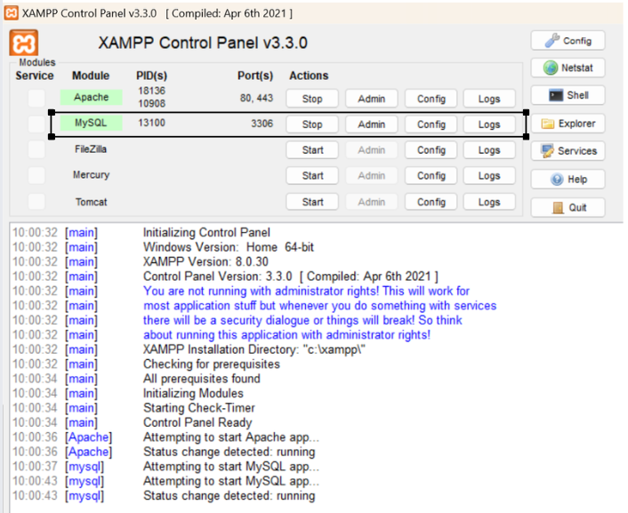
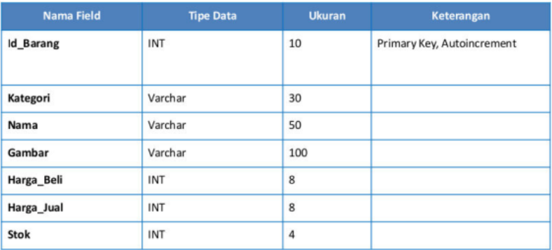
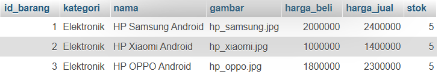
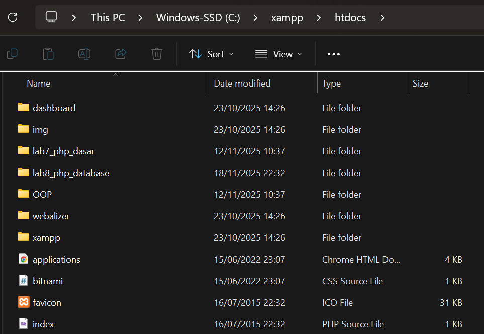
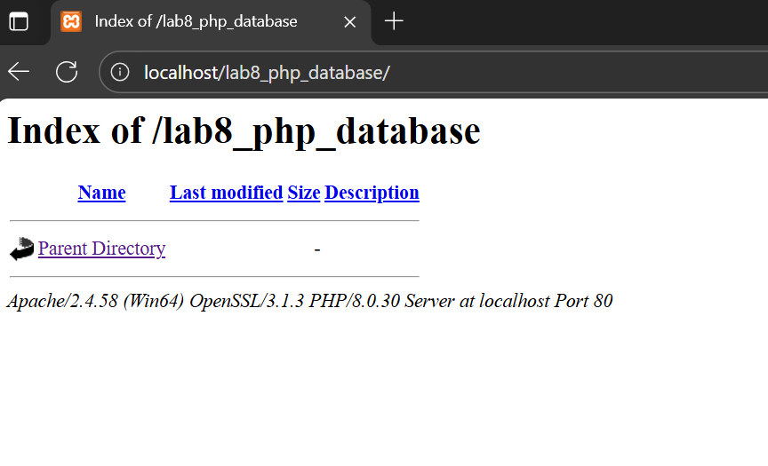
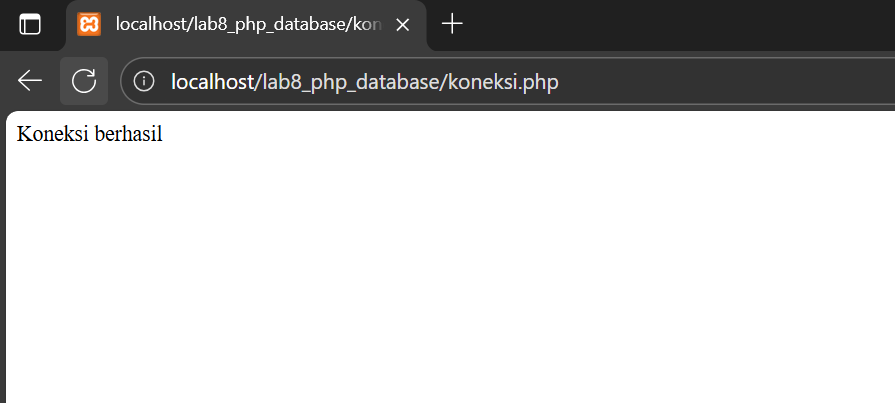
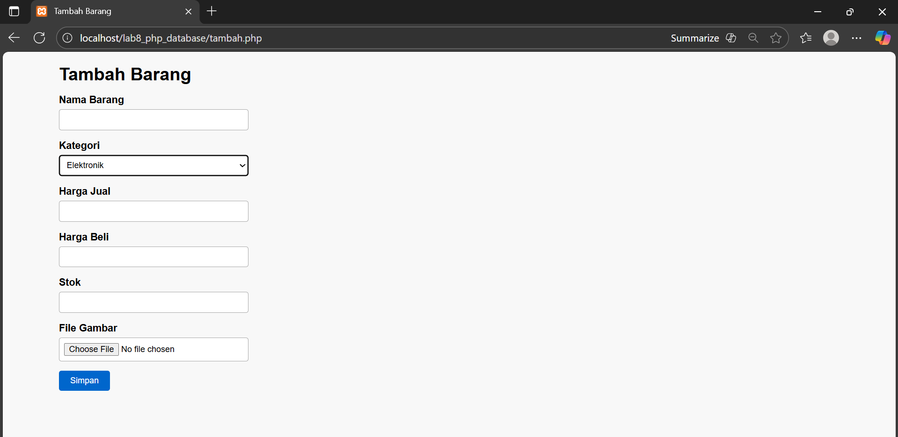
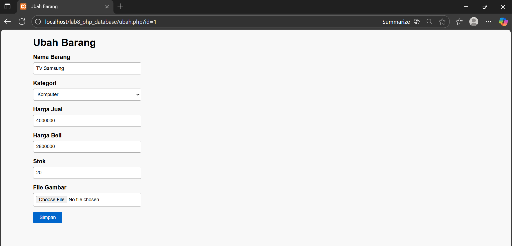

# Lab8Web

Nama : Bagus Sanjaya

Nim : 312410505

Kelas : TI.24.A.5

## Laporan Praktikum

### Lagkah-langkah Praktikum

1. Persiapan

Untuk memulai membuat aplikasi CRUD sederhana, yang perlu disiapkan adalah database server menggunakan MySQL. Pastikan MySQL Server sudah dapat dijalankan melalui XAMPP.

2. Menjalankan MySQL Server

Untuk menjalankan MySQL Server dari menu XAMPP Control.



3. Mengakses MySQL Client menggunakan PHP MyAdmin

Pastikan webserver Apache dan MySQL server sudah dijalankan. Kemudian buka melalui browser: http://localhost/phpmyadmin/

4. Membuat Database: Studi Kasus Data Barang



5. Membuat Database

```
CREATE DATABASE latihan1;
```

6. Membuat Tabel

```
CREATE TABLE data_barang (
    id_barang int(10) auto_increment Primary Key,
    kategori varchar(30),
    nama varchar(30),
    gambar varchar(100),
    harga_beli decimal(10,0),
    harga_jual decimal(10,0),
    stok int(4)
);
```


7. Menambahkan Data

```
INSERT INTO data_barang (kategori, nama, gambar, harga_beli, harga_jual, stok)
VALUES ('Elektronik', 'HP Samsung Android', 'hp_samsung.jpg', 2000000, 2400000, 5),
('Elektronik', 'HP Xiaomi Android', 'hp_xiaomi.jpg', 1000000, 1400000, 5),
('Elektronik', 'HP OPPO Android', 'hp_oppo.jpg', 1800000, 2300000, 5);
```



8. Membuat Program CRUD

Buat folder lab8_php_database pada root directory web server (c:\xampp\htdocs)



Kemudian untuk mengakses direktory tersebut pada web server dengan mengakses URL: http://localhost/lab8_php_database/



9. Membuat file koneksi database

Buat file baru dengan nama `koneksi.php`

```
<?php
$host = "localhost";
$user = "root";
$pass = "";
$db = "latihan1";
$conn = mysqli_connect($host, $user, $pass, $db);
if ($conn == false)
{
    echo "Koneksi ke server gagal.";
    die();
} #else echo "Koneksi berhasil";
?>
```

Buka melalui browser untuk menguji koneksi database (untuk menyampilkan pesan koneksi berhasil, <i>uncomment</i> pada perintah echo “koneksi berhasil”;)



10. Membuat file index untuk menampilkan data (Read)

Buat file baru dengan nama `index.php`

```
<?php
include("koneksi.php");

// query untuk menampilkan data
$sql = 'SELECT * FROM data_barang';
$result = mysqli_query($conn, $sql);
?>
<!DOCTYPE html>
<html lang="en">
<head>
    <meta charset="UTF-8">
    <link rel="stylesheet" href="style.css">
    <title>Data Barang</title>

    <style>
        table {
            border-collapse: collapse;
            width: 100%;
            margin-top: 15px;
        }
        table th, table td {
            border: 1px solid #aaa;
            padding: 8px;
            text-align: left;
        }
        table th {
            background: #eee;
        }
        img {
            width: 120px;
        }
        a {
            margin-right: 5px;
        }
    </style>
</head>
<body>
    <div class="container">
        <h1>Data Barang</h1>

        <a href="tambah.php">Tambah Barang</a>

        <div class="main">
            <table>
                <tr>
                    <th>Gambar</th>
                    <th>Nama Barang</th>
                    <th>Kategori</th>
                    <th>Harga Jual</th>
                    <th>Harga Beli</th>
                    <th>Stok</th>
                    <th>Aksi</th>
                </tr>

                <?php if ($result && mysqli_num_rows($result) > 0): ?>
                    <?php while($row = mysqli_fetch_array($result)): ?>
                        <tr>
                            <td>" alt="<?= $row['nama']; ?>"></td>
                            <td><?= $row['nama']; ?></td>
                            <td><?= $row['kategori']; ?></td>
                            <td><?= $row['harga_jual']; ?></td>
                            <td><?= $row['harga_beli']; ?></td>
                            <td><?= $row['stok']; ?></td>
                            <td>
                                <a href="ubah.php?id=<?= $row['id_barang']; ?>">Ubah</a>
                                <a href="hapus.php?id=<?= $row['id_barang']; ?>" onclick="return confirm('Yakin ingin menghapus?');">Hapus</a>
                            </td>
                        </tr>
                    <?php endwhile; ?>
                <?php else: ?>
                    <tr>
                        <td colspan="7">Belum ada data</td>
                    </tr>
                <?php endif; ?>
            </table>
        </div>
    </div>
</body>
</html>

```

Untuk mengaksesnya gunakan URL: http://localhost/lab7_php_dasar/latihan2.php?nama=Bagus


11. Menambah Data (Create)

Buat file baru dengan nama `tambah.php`

```
<?php
error_reporting(E_ALL);
include_once 'koneksi.php';
if (isset($_POST['submit']))
{
    $nama = $_POST['nama'];
    $kategori = $_POST['kategori'];
    $harga_jual = $_POST['harga_jual'];
    $harga_beli = $_POST['harga_beli'];
    $stok = $_POST['stok'];
    $file_gambar = $_FILES['file_gambar'];
    $gambar = null;
    if ($file_gambar['error'] == 0)
    {
        $filename = str_replace(' ', '_',$file_gambar['name']);
        $destination = dirname(__FILE__) .'/gambar/' . $filename;
        if(move_uploaded_file($file_gambar['tmp_name'], $destination))
        {
            $gambar = 'gambar/' . $filename;;
        }
    }
    $sql = 'INSERT INTO data_barang (nama, kategori,harga_jual, harga_beli, stok, gambar) ';
    $sql .= "VALUE ('{$nama}', '{$kategori}','{$harga_jual}', '{$harga_beli}', '{$stok}', '{$gambar}')"; $result = mysqli_query($conn, $sql);
    header('location: index.php');
}
?>
<!DOCTYPE html>
<html lang="en">
<head>
    <meta charset="UTF-8">
    <link rel="stylesheet" href="style.css">
    <title>Tambah Barang</title>
</head>
<body>
<div class="container">
    <h1>Tambah Barang</h1>
    <div class="main">
        <form method="post" action="tambah.php" enctype="multipart/form-data">
            <div class="input">
                <label>Nama Barang</label>
                <input type="text" name="nama" />
            </div>
            <div class="input">
                <label>Kategori</label>
                <select name="kategori">
                    <option value="Komputer">Komputer</option>
                    <option value="Elektronik">Elektronik</option>
                    <option value="Hand Phone">Hand Phone</option>
                </select>
            </div>
            <div class="input">
                <label>Harga Jual</label>
                <input type="text" name="harga_jual" />
            </div>
            <div class="input">
                <label>Harga Beli</label>
                <input type="text" name="harga_beli" />
            </div>
            <div class="input">
                <label>Stok</label>
                <input type="text" name="stok" />
            </div>
            <div class="input">
                <label>File Gambar</label>
                <input type="file" name="file_gambar" />
            </div>
            <div class="submit">
                <input type="submit" name="submit" value="Simpan" />
            </div>
        </form>
    </div>
</div>
</body>
</html>
```



12. Mengubah Data (Update)

Buat file baru dengan nama `ubah.php`

```
<?php
error_reporting(E_ALL);
include_once 'koneksi.php';
if (isset($_POST['submit']))
{
    $id = $_POST['id'];
    $nama = $_POST['nama'];
    $kategori = $_POST['kategori'];
    $harga_jual = $_POST['harga_jual'];
    $harga_beli = $_POST['harga_beli'];
    $stok = $_POST['stok'];
    $file_gambar = $_FILES['file_gambar'];
    $gambar = null;

    if ($file_gambar['error'] == 0)
    {
        $filename = str_replace(' ', '_', $file_gambar['name']);
        $destination = dirname(__FILE__) . '/gambar/' . $filename;
        if (move_uploaded_file($file_gambar['tmp_name'], $destination))
        {
            $gambar = 'gambar/' . $filename;;
        }
    }
    $sql = 'UPDATE data_barang SET ';
    $sql .= "nama = '{$nama}', kategori = '{$kategori}', ";
    $sql .= "harga_jual = '{$harga_jual}', harga_beli = '{$harga_beli}', stok = '{$stok}' ";
    if (!empty($gambar))
        $sql .= ", gambar = '{$gambar}' ";
    $sql .= "WHERE id_barang = '{$id}'";
    $result = mysqli_query($conn, $sql);
    header('location: index.php');
}
$id = $_GET['id'];
$sql = "SELECT * FROM data_barang WHERE id_barang = '{$id}'";
$result = mysqli_query($conn, $sql);
if (!$result) die('Error: Data tidak tersedia');
$data = mysqli_fetch_array($result);
function is_select($var, $val) {
    if ($var == $val) return 'selected="selected"';
    return false;
}

?>
<!DOCTYPE html>
<html lang="en">
<head>
    <meta charset="UTF-8">
    <link rel="stylesheet" href="style.css">
    <title>Ubah Barang</title>
</head>
<body>
<div class="container">
    <h1>Ubah Barang</h1>
    <div class="main">
        <form method="post" action="ubah.php" enctype="multipart/form-data">
            <div class="input">
                <label>Nama Barang</label>
                <input type="text" name="nama" value="<?php echo $data['nama'];?>" />
            </div>
            <div class="input">
                <label>Kategori</label>
                <select name="kategori">
                    <option <?php echo is_select ('Komputer', $data['kategori']);?> value="Komputer">Komputer</option>
                    <option <?php echo is_select ('Komputer', $data['kategori']);?> value="Elektronik">Elektronik</option>
                    <option <?php echo is_select ('Komputer', $data['kategori']);?> value="Hand Phone">Hand Phone</option>
                </select>
            </div>
            <div class="input">
                <label>Harga Jual</label>
                <input type="text" name="harga_jual" value="<?php echo $data['harga_jual'];?>" />
            </div>
            <div class="input">
                <label>Harga Beli</label>
                <input type="text" name="harga_beli" value="<?php echo $data['harga_beli'];?>" />
            </div>
            <div class="input">
                <label>Stok</label>
                <input type="text" name="stok" value="<?php echo $data['stok'];?>" />
            </div>
            <div class="input">
                <label>File Gambar</label>
                <input type="file" name="file_gambar" />
            </div>
            <div class="submit">
                <input type="hidden" name="id" value="<?php echo $data['id_barang'];?>" />
                <input type="submit" name="submit" value="Simpan" />
            </div>
        </form>
    </div>
</div>
</body>
</html>
```



13. Menghapus Data (Delete)

Buat file baru dengan nama `hapus.php`

```
<?php
include_once 'koneksi.php';
$id = $_GET['id'];
$sql = "DELETE FROM data_barang WHERE id_barang = '{$id}'";
$result = mysqli_query($conn, $sql);
header('location: index.php');
?>
```

11. Kondisi Switch

```
<?php
$nama_hari = date("l");
switch ($nama_hari) {
    case "Sunday":
        echo "Minggu";
        break;
    case "Monday":
        echo "Senin";
        break;
    case "Tuesday":
        echo "Selasa";
        break;
    default:
        echo "Sabtu";
}
?>
```

### Tambahan sedikit style.css yang saya buat

```
* {
    margin: 0;
    padding: 0;
    box-sizing: border-box;
    font-family: Arial, sans-serif;
}

body {
    background: #f8f8f8;
    padding: 20px;
}

.container {
    width: 90%;
    margin: 0 auto;
}

h1 {
    margin-bottom: 15px;
    font-size: 28px;
}

a {
    color: #0066cc;
    text-decoration: none;
}

a:hover {
    text-decoration: underline;
}

table {
    border-collapse: collapse;
    width: 100%;
    margin-top: 15px;
    background: #fff;
}

table th,
table td {
    border: 1px solid #bbb;
    padding: 10px;
    text-align: left;
}

table th {
    background: #eee;
    font-weight: bold;
}

table tr:nth-child(even) {
    background: #f4f4f4;
}

table img {
    width: 120px;
    height: auto;
    object-fit: cover;
}

.input {
    margin-bottom: 15px;
}

.input label {
    display: block;
    margin-bottom: 5px;
    font-weight: bold;
}

.input input[type="text"],
.input input[type="file"],
.input select {
    width: 300px;
    padding: 8px;
    border: 1px solid #aaa;
    border-radius: 4px;
    background: white;
}

.submit input[type="submit"] {
    padding: 8px 18px;
    border: none;
    background: #0066cc;
    color: white;
    cursor: pointer;
    border-radius: 4px;
}

.submit input[type="submit"]:hover {
    background: #004c99;
}
```
